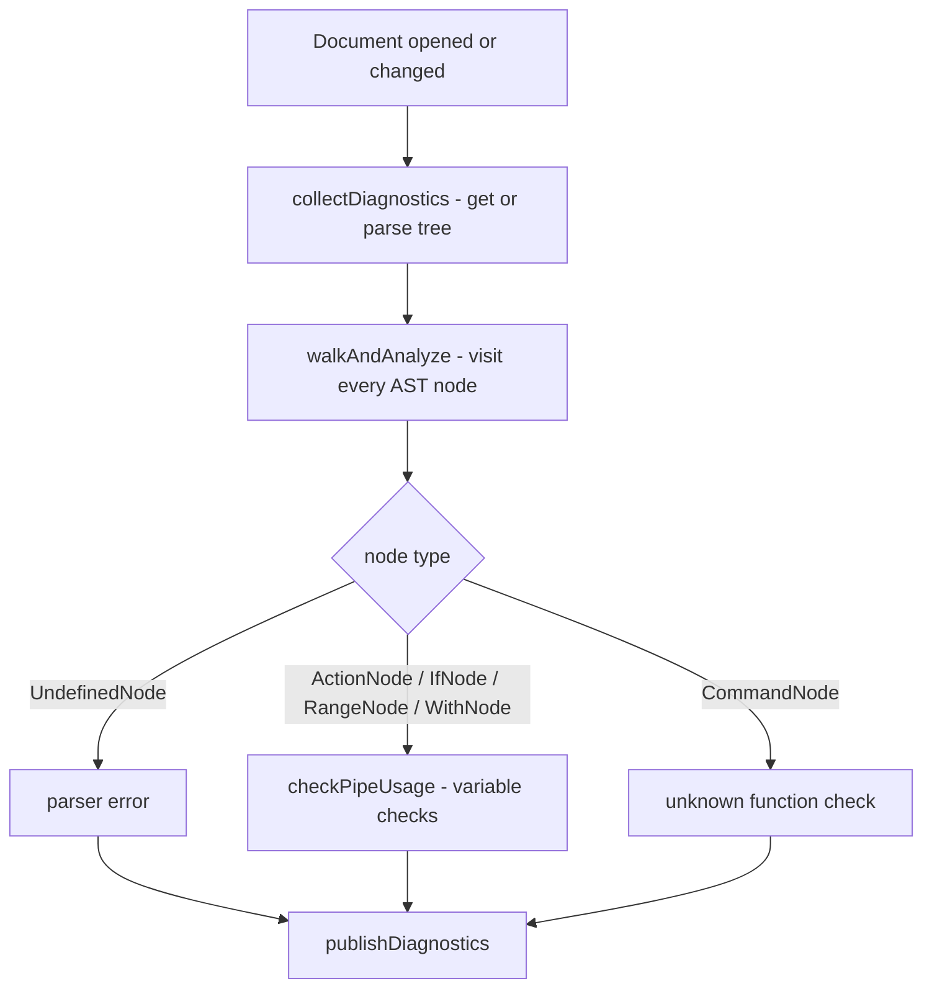
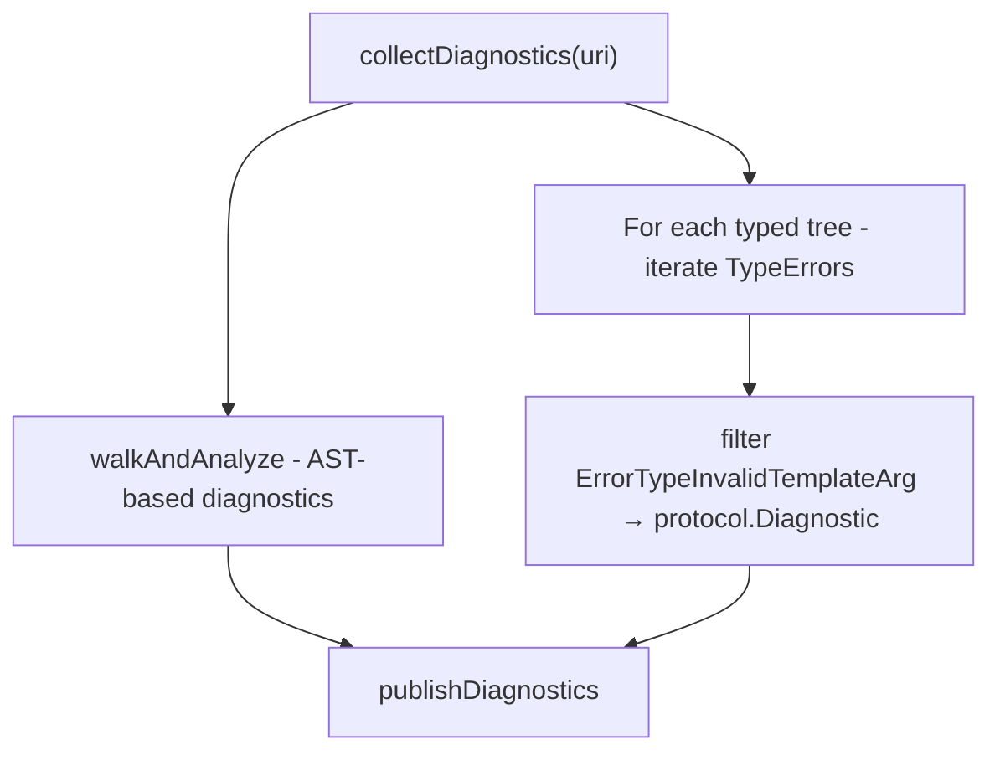

# Diagnostics

Diagnostics report errors in template files as squiggly underlines. They are published via the LSP `textDocument/publishDiagnostics` notification whenever a document is opened or changed.

## What the user sees

| Template input                | Diagnostic message                                                        | Range                                        |
| ----------------------------- | ------------------------------------------------------------------------- | -------------------------------------------- |
| `{{ $?????`                   | `undefined variable: bad character U+003F '?'`                            | The `{{ … }}` block containing the bad token |
| `{{ }}`                       | `template: …: missing value for command`                                  | The full `{{ }}`                             |
| `{{ $x }}` (undeclared)       | `undefined variable: $x`                                                  | The `{{ … }}` block                          |
| `{{ foo }}` Unknown function  | `unsupported function or unregistered command: foo`                       | The `{{ … }}` block                          |
| `{{ $x := 1 }} {{ $x := 2 }}` | `duplicate variable name: $x`                                             | The `{{ … }}` block with the duplicate       |
| `{{template "T" .Order}}`*    | `template "T" expects argument of type models.User, but got models.Order` | The full `{{ … }}` block                     |

*Template `T` has type hint `/*gotype: models.User*/`. See [template_checking.md](template_checking.md).

## Request flow



## UndefinedNode

There are two distinct categories of `UndefinedNode`:

### 1. Real error nodes (`str != ""`)

Created when the lexer encounters a bad token (e.g. `bad character U+003F '?'`) or the parser encounters something it cannot handle. `n.str` contains the original source fragment and `n.Err` holds the corresponding error. These are reported directly as diagnostics.

```go
{{ $?????
         ↑
         lexer.errorf("bad character U+003F '?'")
         -> UndefinedNode{Pos: <offset of $>, str: "bad character U+003F '?'", Err: …}
```

### 2. Recovery markers (`str == ""`)

`checkPipeline` (parse.go) inserts an empty-str `UndefinedNode` when a pipeline has no commands at all (e.g. `{{ }}`). There are two sub-cases:

| Sub-case                                 | Err message                     | Action                                                                                     |
| ---------------------------------------- | ------------------------------- | ------------------------------------------------------------------------------------------ |
| `{{ }}` - empty action with no lex error | `"… missing value for command"` | Report the error; position is valid                                                        |
| `{{ $?????` - post-lex-error recovery    | nil or unrelated message        | Skip; the real error is already covered by the non-empty `UndefinedNode` for the bad token |

The server handles these with the following logic (`analyzeNode`):

```go
str != ""                                  // ->  report as "undefined variable: <str>"
str == "" && err contains "missing value"  // ->  report using err.Error() as message
str == "" && everything else               // ->  skip (structural artifact)
```

`lexer.errorf()` records the error item and returns nil to terminate the current state-machine step. It does not modify `l.pos`, `l.start`, or `l.input`, so subsequent `nextItem()` calls resume lexing from the position immediately after the bad token:

```go
func (l *lexer) errorf(format string, args ...any) stateFn {
    l.item = item{itemError, l.start, fmt.Sprintf(format, args...), l.startLine}
    return nil
}
```

This means each bad character in `{{ $?????` produces its own error token (and therefore its own `UndefinedNode` and diagnostic), rather than one diagnostic covering the whole run.

## Range computation

Diagnostics use `expandToFullBracketsFromOffset(pos, text)` to expand a byte offset to the full surrounding `{{ … }}` block:

1. Search backwards from `pos` for the nearest `{{` - that becomes the start.
2. Search forwards from `pos` for the nearest `}}` - that becomes the end.
3. If no `}}` is found before a newline, the end is capped at the newline (handles unterminated actions).

Both offsets are then converted to `(line, character)` positions with `offsetToPosition`.

## Template Type Errors

Type errors from templates are collected separately from AST-based diagnostics. These errors are generated during type analysis by the `server/types` package:



**When this occurs:** When a `{{template "name" arg}}` call is analysed:

1. The type system looks up the template name in the global `templateInputTypes` registry
2. If a type is found, the argument's type is resolved
3. If argument type is not the expected type, an `ErrorTypeInvalidTemplateArg` is recorded
4. The error is later converted to a diagnostic with range covering the full `{{ template … }}`

**Example:** Template `AuthorTpl` declares `/*gotype: models.Author*/` but is called with an `Order`:

```go
Document:  {{template "AuthorTpl" .}}
                                   ^ (. is models.Order)

Diagnostic: template "AuthorTpl" expects argument of type models.Author, but got models.Order
```

See [template_checking.md](template_checking.md) for more details on how template type hints work.
