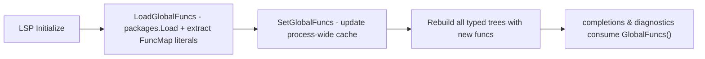

# Function Hints (`//tmpl:func`)

Function hints let the language server discover **user-defined template functions** in the workspace's Go source and expose them to templates with full type information - completion items, type-checking in diagnostics, and hover details.

## What the user writes

Annotate the Go function that returns a `FuncMap` (or any value with `FuncMap` in its type) with a `//tmpl:func "<scope>"` comment immediately above it:

```go
package funcs

import "text/template"

//tmpl:func "global"
func GlobalFuncs() template.FuncMap {
    return template.FuncMap{
        "upper":   strings.ToUpper,
        "lower":   strings.ToLower,
        "repeat":  strings.Repeat,
        "sprintf": fmt.Sprintf,
        "shout":   func(s string) string { return s + "!" },
    }
}
```

Scopes:

| Scope         | Behaviour                                                             |
| ------------- | --------------------------------------------------------------------- |
| `global`      | All entries are exposed to every template as global functions.        |
| anything else | Reserved for future per-template / per-tag scopes; currently ignored. |

The next `FuncMap` composite literal encountered after the comment is the one harvested - typically the literal returned inside the function body, but any literal of a type whose name is `FuncMap` (`template.FuncMap`, `html/template.FuncMap`, an alias, …) is accepted.

## Resolution flow

### Initial load (LSP initialize)



### Hot reload (workspace/didChangeWatchedFiles)


## Implementation details

**Comment detection**: `regexp` `tmpl:func\s+"([^"]+)"` matched against every comment in `file.Comments`. The doc-comment of a `FuncDecl` is included because `packages.Load` with `NeedSyntax` parses with `parser.ParseComments`.

**Map type check**: `isFuncMapType` accepts `FuncMap` either as a bare identifier or as the `Sel` of a selector expression (`template.FuncMap`, `html_template.FuncMap`, alias names, …). The actual underlying type is not checked - by convention only `FuncMap` literals are annotated.

**Function resolution**: `extractFuncMapInto` walks the literal's `Elts`, requires each key to be a string literal, and resolves the value through `resolveFuncObj`:

| Value form                                                | Resolved to                                                                                                                                                                                                                  |
| --------------------------------------------------------- | ---------------------------------------------------------------------------------------------------------------------------------------------------------------------------------------------------------------------------- |
| `Ident` (e.g. `Upper`)                                    | `info.ObjectOf(ident).(*types.Func)`                                                                                                                                                                                         |
| `SelectorExpr` (e.g. `fmt.Sprintf`)                       | `info.ObjectOf(sel.Sel).(*types.Func)`                                                                                                                                                                                       |
| `IndexExpr` (e.g. `Sequence[int]`)                        | The underlying generic `*types.Func` (`Sequence`).                                                                                                                                                                           |
| `IndexListExpr` (e.g. `Pair[string, int]`)                | The underlying generic `*types.Func` (`Pair`).                                                                                                                                                                               |
| `CallExpr` (factory call, e.g. `BuildBox(4)`)             | A synthetic `*types.Func` whose signature is the call's result type and whose position points at the callee. The callee's package is preserved. If the call result is not a `*types.Signature`, the callee is returned as-is. |
| function literal (e.g. `func(s string) string { … }`)     | A synthetic `*types.Func` with `token.NoPos`, the FuncMap key as its name, and the literal's signature.                                                                                                                       |
| anything else                                             | `nil` (the name is still registered)                                                                                                                                                                                         |

A `nil` value means "the name is known but the signature is not". The identifier still completes; type-aware diagnostics simply skip it.

**Factory calls**: when a FuncMap value is a call expression, the entry's signature is the *result type* of the call and its definition position is the callee. Given:

```go
func BuildBox(width int) func(s string) string {
    return func(s string) string {
        return strings.Repeat("*", width) + s + strings.Repeat("*", width)
    }
}

//tmpl:func "global"
func GlobalFuncs() template.FuncMap {
    return template.FuncMap{
        "box": BuildBox(4),
    }
}
```

`box` is typed as `func(string) string` and go-to-definition jumps to `BuildBox`. Arguments passed to the factory at registration time (`4`) are not visible to templates.

**Generic instantiations**: `IndexExpr` and `IndexListExpr` are unwrapped to the generic declaration. Template-side type checking sees the generic signature, not the instantiated one - constraints from `[T any]` do not propagate into template diagnostics.

`text/template` requires every registered function to return either one value or `(value, error)`. A single slice, map, struct, or array counts as one value; multi-value returns like `(string, int)` are rejected by `template.FuncMap` at template-parse time.

**Caching**: `SetGlobalFuncs` / `GlobalFuncs` guard a process-wide map with a `sync.RWMutex`. `GlobalFuncs` returns a snapshot so callers may mutate freely.

**Consumption**:

- [`server/types/analyse.go`](../../server/types/analyse.go) - `analyseIdentifier` looks names up in `ctx.funcs` (populated from the cache via `types.NewTree`). When found, the identifier node gets the function's signature as its `ValueType`, which lets pipes and commands compute downstream types. Unknown names produce an `ErrorTypeInvalidFunction` diagnostic only when absent from both the builtin list **and** `GlobalFuncs()`.
- [`server/handlers/completions_ast.go`](../../server/handlers/completions_ast.go) - `builtinItems()` appends one `CompletionItemKindFunction` item per `GlobalFuncs()` key (de-duplicating against the hard-coded builtin names).
- [`server/handlers/completion.go`](../../server/handlers/completion.go) - `allGlobalFunctions()` unions `builtinFunctions` with the cache keys for the regex-based fallback completion path; builtins always win.
- [`server/handlers/diagnostics.go`](../../server/handlers/diagnostics.go) - the `CommandNode` visitor allows an identifier if it is in `builtinOutput` **or** in `GlobalFuncs()`, suppressing the "unsupported function" diagnostic for registered user-defined functions.

## Limitations

- Function literals (inline `func(…) … { … }` values) get a synthetic `*types.Func` carrying the signature but no source position; go-to-definition lands on the FuncMap key in the registration file rather than on a real declaration.
- Factory calls expose the result-type signature only; arguments passed to the factory at registration time are not visible inside templates.
- Generic instantiations resolve to the underlying generic declaration; template-side type checking sees the generic signature, not the instantiated one.
- A hint above a function that does not return a `FuncMap` literal is silently ignored (the next literal of a different type is not matched).
- Only the `global` scope is implemented; other scope strings are reserved.
- `packages.Load` is invoked per discovered module root; nested modules are picked up, but roots outside the configured workspace folder are not scanned.

## Live reload

The server registers a dynamic `workspace/didChangeWatchedFiles` watcher for `**/*.go` via `client/registerCapability` during the `initialized` callback (see [`server/handlers/watched_files.go`](../../server/handlers/watched_files.go)). Editors that support dynamic registration (VS Code, JetBrains LSP4IJ) will push `.go` change notifications automatically. On receipt the global-function cache is reloaded and every open template document is rebuilt, so completions and diagnostics update without a server restart.

## Test fixture

[`test/resources/funcmap-tests`](../../test/resources/funcmap-tests) - a minimal module with one package exposing a `global` map (`upper`, `lower`, `repeat`, `shout`, `sprintf`, `box`, `sequenceI`, `pairSI`) and a non-global map (`localOnly`). Used by:

- `TestLoadGlobalFuncs` - end-to-end load via `packages.Load`.
- `TestLoadGlobalFuncs_BuilderFactory` - `"box": BuildBox(4)` resolves to a `*types.Func` whose signature is `func(string) string` and whose position points at `BuildBox`.
- `TestLoadGlobalFuncs_GenericInstantiation` - `Sequence[int]` (`IndexExpr`) and `Pair[string, int]` (`IndexListExpr`) resolve to the underlying generic `*types.Func`.
- `TestResolveCalleeFunc_GenericInstantiation` - AST-level coverage of the generic-instantiation branches in `resolveCalleeFunc`.
- `TestResolveFuncObj_CallExprFallback` - a `CallExpr` whose result is not a signature falls back to the callee.
- `TestCollectGlobalFuncs_OnlyGlobalHint` - inline AST test confirming non-global scopes are filtered.
- `TestGlobalFuncsCacheRoundTrip` - snapshot isolation of the cache.
- `TestIsFuncMapType` - unit coverage for the type-name matcher.
