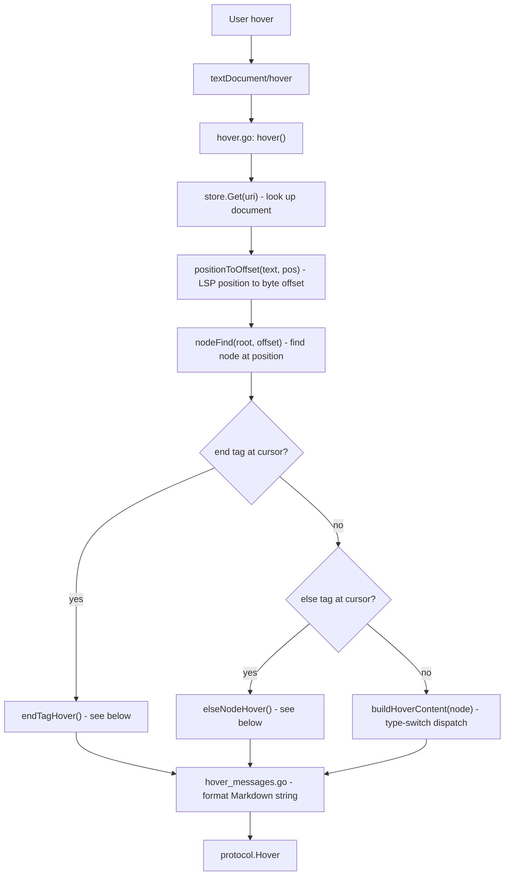
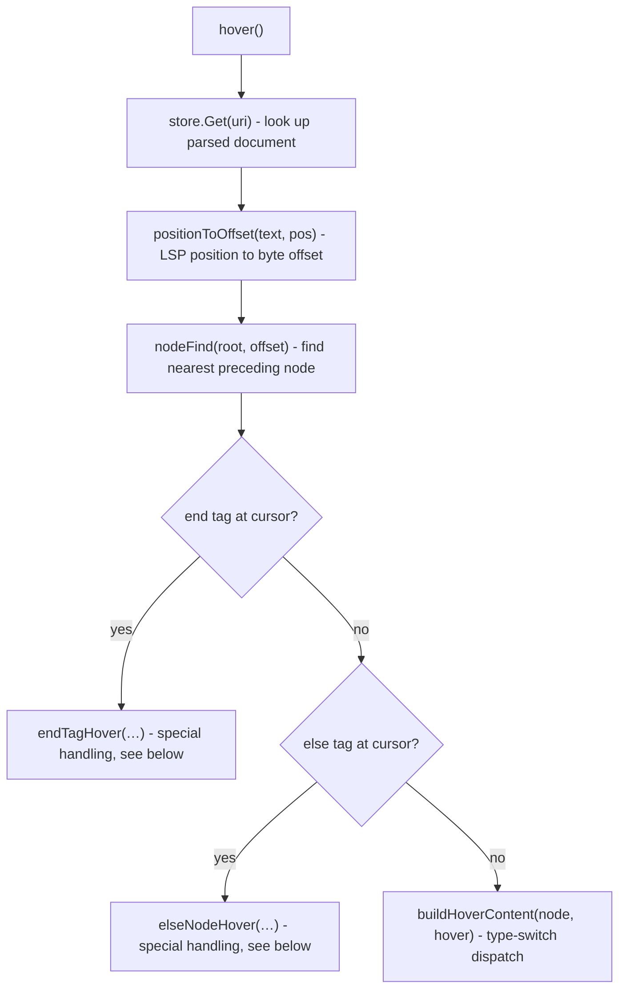

# Hover Provider

The hover provider gives contextual documentation when the user holds the cursor over any node in a Go text/template (`.tmpl`) file. It is implemented as an LSP `textDocument/hover` handler in the language server and is consumed by both the VS Code and JetBrains clients.

## What the user sees

| Cursor position                  | Tooltip                                                                                                                    |
| -------------------------------- | -------------------------------------------------------------------------------------------------------------------------- |
| `{{ if  .IsAdmin }}`             | `if .IsAdmin` - If the value of the pipeline is empty, no output is generated; Otherwise, inside is executed.              |
| `{{  range  $i, $v := .Items }}` | `range $i, $v := .Items` - Branch executed for each item in a collection.                                                  |
| `{{  with  .Value }}`            | `with .Value` - Branch executed with a new context.                                                                        |
| `{{ range  $i , $v := .Items }}` | `var $i int` - Serves as the index variable in the `range` loop, representing the current iteration count.                 |
| `{{ range $i,  $v  := .Items }}` | `var $v Type` (or `(unknown)` if not resolvable)                                                                           |
| `{{- end -}}`                    | `end` - From `` `if` `` / `` `range` `` / `` `with` `` at line N                                                           |
| `{{- else }}`                    | `else` - From `` `if` `` / `` `range` `` / `` `with` `` at line N                                                          |
| `.`                              | Returns the current context.                                                                                               |
| `.Name`                          | `field .Name` - Accesses the `Name` field of the `.` context.                                                              |
| `len`                            | A built-in function that returns the length of its argument.                                                               |
| `and`                            | A built-in function that returns the first argument if it is false, and the last argument otherwise.                       |
| `or`                             | A built-in function that returns the first argument if it is true, and the last argument otherwise.                        |
| `not`                            | A built-in function that returns the boolean negation of its argument.                                                     |
| Other identifiers                | Represents an identifier in a command or action.                                                                           |
| `nil`                            | `nil` is a predeclared identifier representing the zero value for a pointer, channel, func, interface, map, or slice type. |

All tooltips are rendered as Markdown.
They are defined separately from the provided code as format strings, which are later injected with the information specific to the hovered over node

## Request flow

## Implementation details

### Entry point - `hover()`

`hover.go:16` is the LSP handler registered for `textDocument/hover`. It receives a `HoverParams` value containing the document URI and the cursor position as `{line, character}`

### Special case: `{{end}}` hover

`{{end}}` tags do not appear as their own AST node - the parser consumes them to close a branch (`if`, `range`, `with`, `template`) but records no node for the tag itself. As a result, `nodeFind` returns the preceding node to the closing tag, which carries no useful information on its own. It might also happen that the preceding node is not in the same level as the branch which the end tag is closing, if whitespace trims are used.

`endTagHover` (`hover.go:211`) handles this by working at the text level:

1. **Regex scan**: It matches `{{-?\s*end\s*-?}}` against the hovered line to find all end-tag spans and checks whether the cursor column falls inside one.
2. **Backward count**: Starting from the hovered end-tag, it scans upward line by line counting end tag it encounters. Each one means there is one more nesting level to skip before the matching opening tag is found.
3. **Path walk**: `buildPath` reconstructs the ancestor chain from the root down to the node that `nodeFind` returned. `endTagHover` then iterates this path in reverse, skipping one `RangeNode / IfNode / WithNode / TemplateNode` for each counted nesting level and returning the first one after all levels are accounted for.
4. **Range**: The hover range is set to exactly the `{{end}}` span on the line so the tooltip highlights the tag precisely.

This logic correctly resolves end tags even when multiple blocks close on the same line (e.g. `{{- end -}}{{- end -}}`).

### Special case: `{{else}}` hover

Similarly to end nodes, `{{else}}` and `{{else if …}}` nodes are not distinctly represented in the AST. Instead, the node under the cursor is the preceding node rather than a dedicated else node. The existence of the else tag is only recorded as the ElseList element of a list node which does not hold the required information.

`elseNodeHover` (`hover.go:291`) uses the same approach as end-tag hover:

1. **Regex scan**: Matches `{{-?\s*else\b` against the line.
2. **Backward count**: Counts intervening `{{end}}` tags (using `endReg`) above the cursor to determine nesting depth, since an else can only belong to a block at the same nesting level.
3. **Path walk**: Finds the matching `IfNode`, `RangeNode`, or `WithNode` in the ancestor path, skipping the same number of nesting levels.
4. **Message**: `MessageElse` reports the *type* of the controlling branch and the 1-indexed line number where it opened.

### Per-node dispatch - `buildHoverContent`

For all other nodes, `buildHoverContent` (`hover.go:85`) is a `switch target.(type)` over every concrete AST node type exported by the `text-template-parser` package. Each arm calls the corresponding `MessageXxx` function in `hover_messages.go`.

`IfNode`, `RangeNode`, and `WithNode` all embed `*parse.BranchNode`, so they share `MessageBranch`, which formats the template depending on the `NodeType` field.

### Index variable detection

`VariableNode` is used for both range-index variables (`$i` in `{{range $i, $v := …}}`) and ordinary declared variables. The hover message differs: an index variable gets a note explaining it represents the iteration counter.

`isIndexVariable` (`hover.go:371`) detects which case applies:

1. It rebuilds the ancestor path for the variable node via `buildPath`.
2. If the immediate parent in the path is a `RangeNode` *and* the variable is the first declaration in the pipe (`pipe.Decl[0] == target`), the variable is the index.
3. If the parent is not a `RangeNode`, `wasDeclaredAsIndex` checks whether any `RangeNode` ancestor in the path has a matching `Decl[0]` - handling the case where `$i` is *used* inside the body rather than at the declaration site.

### Hover messages - `hover_messages.go`

Messages are stored in two maps:

- `nodeMessage` (`hover_messages.go:12`) - keyed by `parse.NodeType`, holds a `fmt.Sprintf`-compatible Markdown template for every standard node kind.
- `specialMessages` (`hover_messages.go:33`) - keyed by identifier string, holds overrides for the built-in functions (`and`, `or`, `not`, `len`) and the synthetic `end`/`else` messages.

Each exported `MessageXxx` function picks the right template, substitutes node-specific values (pipeline text, field name, line number, etc.), and returns the formatted string. Callers in `buildHoverContent` and the two special-case handlers pass the returned string directly into a `protocol.MarkupContent{Kind: MarkdownKindMarkdown}` value.

## Tests

Tests live in `server/handlers/hover_test.go` and `hover_testcases.go`.

`TestHover` iterates over `hoverTestCases`, a table of scenarios defined in `hover_testcases.go`. Each case specifies:

- A template document string.
- A target line and a *range* of character positions (`positionCharacterStart` to `positionCharacterEnd`). The test asserts that the tooltip is identical for every column in that range, verifying that the hover is stable across the full token span.
- The expected `protocol.Hover` value, including both the `Contents` (Markdown string) and the `Range` (highlighted span).

Covered scenarios include: `{{end}}` with one, two, and three nested closings on the same line; `{{else}}` and `{{else if}}`; range index vs. value variables both at the declaration and at usage sites; field access; `if`/`range`/`with` opening tags; and the built-in functions `and`, `or`, `not`, `ge`.
