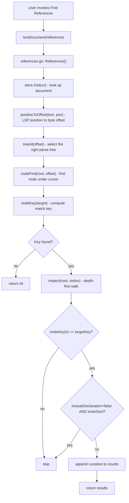

# Find References

The references provider lists every occurrence of a variable or identifier within the current template file. It is implemented as an LSP `textDocument/references` handler and is consumed by both the VS Code and JetBrains clients.

## What the user sees

Invoke with Right-click -> *Find All References* (VS Code: <kbd>Shift</kbd>+<kbd>F12</kbd>). The editor highlights all matching positions and shows them in a references panel.

| Symbol                            | Behaviour                                                                                                                     |
| --------------------------------- | ----------------------------------------------------------------------------------------------------------------------------- |
| `$x` (variable)                   | All uses of `$x` in the file; the declaration is included or excluded based on the `IncludeDeclaration` flag the editor sends |
| `upper`, `len`, or any identifier | All uses of that identifier name in the file                                                                                  |

**Not supported:** field access nodes (`.FieldName`) - find references returns nothing when the cursor is on a field segment.

**Scope:** references are searched only within the current file. Cross-file reference search is not implemented.

## Request flow

## Implementation details

### Node keys

`nodeKey` assigns a string key to each node that the references provider can match:

| Node type        | Key format        | Example                   |
| ---------------- | ----------------- | ------------------------- |
| `VariableNode`   | `var:<name>`      | `var:$x`                  |
| `ChainNode`      | `var:<base name>` | `var:$x` (for `$x.Field`) |
| `IdentifierNode` | `id:<ident>`      | `id:upper`                |
| `FieldNode`      | *(not supported)* | -                         |

Two nodes match if and only if their keys are equal, so `$x` declared in one place is considered the same symbol as `$x` used anywhere else in the same tree.

### Declaration exclusion

When the IDE sends `IncludeDeclaration: false`, `isVarDecl` checks whether the node is a variable declaration (a `VariableNode` whose `Ident[0]` matches the key). Declarations are `VariableNode`s that appear in `PipeNode.Decl` but are structurally indistinguishable at the node level, so the exclusion uses the key match as a proxy: any `VariableNode` whose name matches is treated as a potential declaration site.

### Tree scope

`treeAt(offset)` selects the tightest `*parse.Tree` that contains the cursor position (root tree or a named `{{define}}` block). The `inspect` walk is limited to that single tree, so a `$x` in one `{{define}}` block will not match a `$x` in another.
