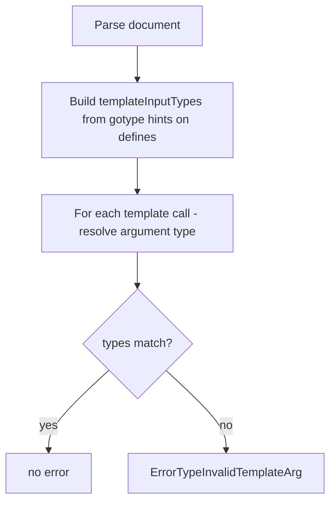
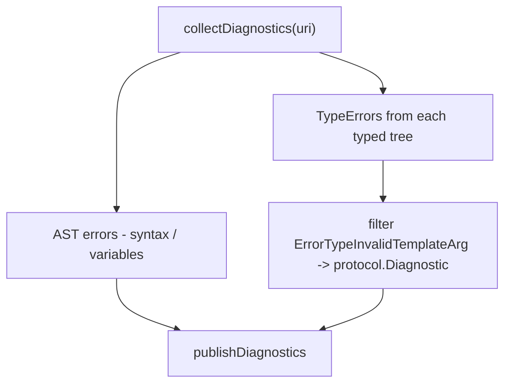

# Template Type Checking

Template type checking validates that {{template}} calls pass arguments of the correct type. Named templates can declare their expected input type via type hints, and the language server will flag mismatches as diagnostics.

## What the user sees

When a template is called with an argument whose type doesn't match the template's declared input type:

| Template Definition               | Template Call                   | Diagnostic Message                                                              |
| --------------------------------- | ------------------------------- | ------------------------------------------------------------------------------- |
| `{{- /*gotype: models.User*/ -}}` | `{{template "UserTpl" .Order}}` | `template "UserTpl" expects argument of type models.User, but got models.Order` |
| `{{- /*gotype: string*/ -}}`      | `{{template "NameTpl" .User}}`  | `template "NameTpl" expects argument of type string, but got models.User`       |

## How it works

### 1. Template Registration

When a document is parsed, the language server extracts:

- **Template names** from `{{define "name"}}` blocks
- **Input types** from type hints (`{{- /*gotype: pkg.Type*/ -}}`) associated with each template

Named templates are stored in a registry (`templateInputTypes`), mapping template name -> expected input type. This registry is scoped per document and available globally for same-file or cross-file `{{template}}` calls.

### 2. Type Analysis

During type analysis of a template file:



### 3. Error Reporting

Mismatches are stored as `TypeErrors` in the typed tree and surfaced to the user as diagnostics:



## Example Scenarios

### Basic Type Mismatch

#### Document A: models.go

```go
package models

type User struct {
    Name  string
    Email string
}

type Order struct {
    ID       string
    Customer *User
}
```

#### Document B: user-template.html.tmpl

```html
{{- /*gotype: models.User*/ -}}
<h1>{{ .Name }}</h1>
<p>{{ .Email }}</p>

{{define "OrderTpl"}}
{{- /*gotype: models.Order*/ -}}
Order #{{ .ID }} by {{ .Customer.Name }}
{{end}}
```

#### Document C: page.html.tmpl

```html
{{- /*gotype: models.Order*/ -}}

<!-- ✅ Correct: Order template receives Order type -->
{{ template "OrderTpl" . }}

<!-- ❌ Error: User template expects User, got Order -->
{{ template "UserTpl" . }}

<!-- ✅ Correct: User template receives User type -->
{{ template "UserTpl" .Customer }}
```

The server will report a diagnostic on the second template call (passing the whole Order instead of the User).

### Same-File Multiple Defines

```gotmpl
{{- /*gotype: models.User*/ -}}
User: {{ .Name }}

{{define "EmailTpl"}}
{{- /*gotype: models.User*/ -}}
Email: {{ .Email }}
{{end}}

{{define "CustomTpl"}}
{{ .NoSuchField }}
{{end}}

<!-- ✅ Correct type -->
{{ template "EmailTpl" . }}

<!-- ❌ Wrong type: expects User, got string -->
{{ template "EmailTpl" "some@email.com" }}

<!-- ❌ No type hint for CustomTpl, so no type check -->
{{ template "CustomTpl" . }}
```

## Registry Scope and Lifecycle

### Storage

Templates are stored in `DocumentStore`:

- `uriTemplateNames[uri]` maps each URI to its defined template names
- `templateInputTypes[name]` maps template name to expected input type (global)

### Lifecycle

1. **On document open/change** (`onOpen`, `onChange` in documents.go):
   - Parse the document
   - Extract `{{define}}` blocks and their type hints
   - Update `templateInputTypes` registry
   - Build typed trees for all templates in the document

2. **On template call analysis**:
   - Look up the template name in `templateInputTypes`
   - Compare argument type against registered expected type
   - Generate error if mismatch

3. **On cleanup** (document deletion):
   - Remove the document's templates from the registry
   - Clear associated type errors

### Cross-File References

Template names are **global** within the registry. If File A calls `{{template "UserTpl" ...}}` but File B defines it:

1. File B's type hint for `UserTpl` is registered in `templateInputTypes`
2. File A's analysis can look it up when checking the call
3. Type mismatches are reported in File A

## Type Comparison

Type matching uses **string equality** on the type's `String()` representation:

```go
if argType.String() != expectedType.String() {
    // -> error
}
```

This means:

- `*models.User` and `*models.User` -> match
- `models.User` and `*models.User` -> mismatch (different pointer levels)
- `text-template-server/src/models.User` and `text-template-server/src/models.User` -> match (full qualified path)

## Missing Type Hints

If a template has **no type hint**, the language server cannot perform type checking for calls to that template:

```gotmpl
{{define "NoHintTpl"}}
{{ . }}
{{end}}

<!-- No type checking performed -->
{{ template "NoHintTpl" . }}
```

## Implementation Details

### Core Files

- **documents.go**: Registers templates and builds typed trees
  - `Set()`: Extracts template names and builds `templateInputTypes`
  - `buildTypedTree()`: Passes `templateInputTypes` to type analysis

- **analyse.go** (types package): Validates template calls
  - `analyseTemplate()`: Checks argument type against expected type
  - Records `ErrorTypeInvalidTemplateArg` on mismatch

- **diagnostics.go**: Surfaces errors to user
  - `collectTemplateArgTypeDiagnostics()`: Converts type errors to diagnostics

### Type Error

Defined in `server/types/analyse.go`:

```go
ErrorTypeInvalidTemplateArg  // Template called with wrong argument type
```

Recorded as:

```go
ctx.errorf(
    t,
    ErrorTypeInvalidTemplateArg,
    "template %q expects argument of type %s, but got %s",
    templateName,
    expectedType,
    actualType,
)
```

## Limitations

1. **No variadic templates**: Templates cannot declare multiple input types or optional arguments
2. **String-based comparison**: Type checking relies on string representation, not structural equivalence
3. **Global registry**: All templates share a single namespace; collisions between files are not prevented
4. **Type hint required**: Templates without type hints cannot be checked

## See Also

- [Type Hints](type_hints.md) - How to declare template input types via `/*gotype:*/` comments
- [Diagnostics](diagnostics.md) - How errors are reported to the user
- [types.md](../types.md) - Architecture of the type system
