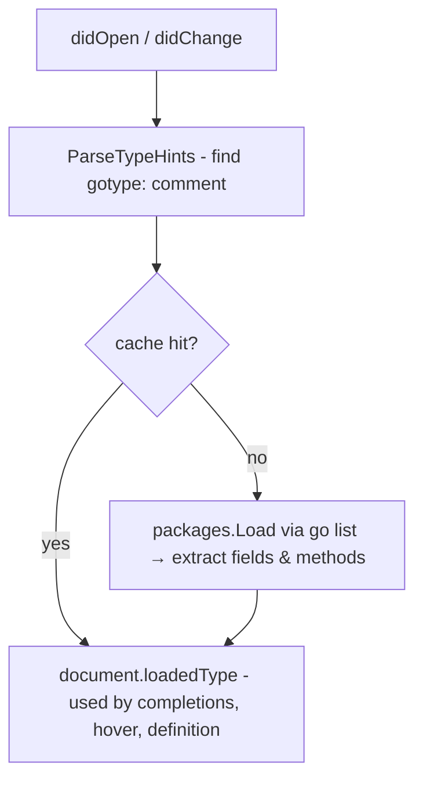

# Type Hints

Type hints let the language server resolve a real Go type against the template's dot context (`.`), enabling field and method completions that reflect the actual data model rather than a generic dot item.

## What the user writes

```
{{- /*gotype: github.com/example/myapp/models.User*/ -}}
```

Any of the following forms are recognised:

| Hint form | Resolved as |
|---|---|
| `{{/*gotype: models.User*/}}` | type `User` in local package `models` |
| `{{- /* gotype: models.User */ -}}` | same - trimming dashes and surrounding whitespace are ignored |

## Resolution flow



### Caching

`packages.Load` (which internally invokes `go list`) can take 2–3 seconds per hint. Results are cached in memory after the first load, keyed by `(hint, workspaceRoot)`. Subsequent `didOpen`/`didChange` events for any template that uses the same hint return immediately from the cache.

The cache is invalidated whenever a `.go` file in the workspace changes (`workspace/didChangeWatchedFiles`), so edits to the Go model are always reflected on the next completion or hover request.

## Multiple `{{define}}` blocks

A single template file may contain any number of named sub-templates introduced with `{{define "name"}} … {{end}}`. Each block can carry its own independent type hint, allowing different blocks to resolve `.` against different Go types.

### Where to place the hint

| Block | Where to put the hint |
|---|---|
| Root template | First line of the file |
| Named define | Line immediately after the opening `{{define "name"}}` directive |

Example:

```
{{- /*gotype: github.com/example/myapp/models.Address*/ -}}
{{ .Street }}

{{define "OrderTpl"}}
{{- /*gotype: github.com/example/myapp/models.Order*/ -}}
Order: {{ .CustomerName }} ({{ .ID }})
{{end}}

{{define "NoHint"}}
{{ $local := . }}
no hint here
{{end}}
```

In this file `.Street` resolves against `Address`, `.CustomerName` and `.ID` resolve against `Order`, and the `NoHint` block has no type resolution (type-aware features are disabled for that block only).

### How it works internally

The parser produces one `*parse.Tree` per `{{define}}` block plus one for the root, all stored keyed by tree name. On every `didOpen`/`didChange` the server:

1. Iterates every tree and looks up the hint for that tree (`hintTypeForTree`).
2. Calls `CachedLoadTypeFromHint` for each tree that has a hint, returning a cached `*Tree` if the same hint was already resolved, or invoking `packages.Load` on a cache miss. Results are stored in a per-tree map (`loadedTypes`/`typedTrees`).
3. At query time (`hover`, `completion`, `definition`, …), `treeAt(offset)` identifies which tree owns the cursor position, and the correct per-tree type is used - independently of every other block in the same file.

Because multiple `{{define}}` blocks in the same file (or across different files) often reference the same model type, caching is especially beneficial here: a file with three defines pointing to the same package only triggers one `go list` invocation instead of three.

## Implementation details

**Parsing**: Lines without `gotype:` are skipped. The regex `gotype:\s*([A-Za-z_][A-Za-z0-9_/.-]*)` extracts the hint token; only the first match per file is used.

**Splitting**: `splitTypeHint` finds the last `.` with no `/` to its right to separate import path from type name. A bare `User` (no dot) uses `.` as the import path.

**Loading**: `CachedLoadTypeFromHint` checks an in-memory cache first. On a miss it calls `packages.Load` with `packages.NeedTypes` and the workspace root, then stores the result. Any load error is logged as a warning; the document is stored without a type. The cache is cleared by `InvalidateTypeHintCache` when any `.go` file in the workspace changes.

**Fields**: `structFields` collects exported fields as `[]TypeField` (name, type string, raw `types.Type`, `Embedded` flag). `TypeField.Kind()` classifies each as `String`, `Bool`, `Int`, `Float`, `Slice`, `Map`, `Struct`, or `Other`.

**Methods**: `namedMethods` keeps exported methods returning one or two values as `[]MethodType`; the return type string is shown as the completion `Detail`.

**Consumption**: `completionAst` passes the resolved type via `ctx.DotType`; `buildPathChildren` narrows it inside `RangeNode` and `WithNode` bodies.