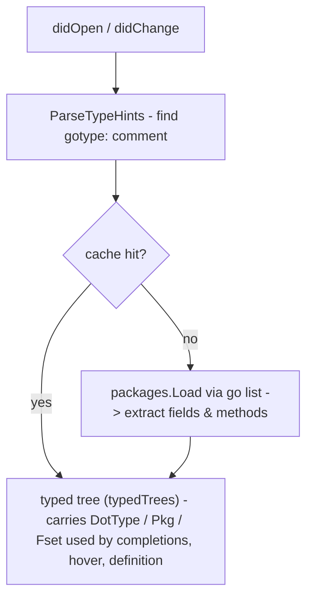
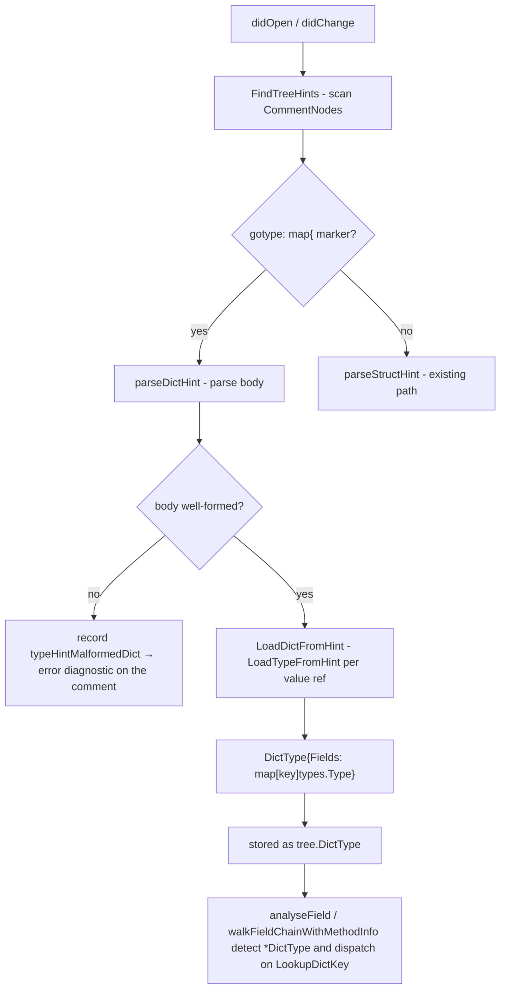

# Type Hints

Type hints let the language server resolve a real Go type against the template's dot context (`.`), enabling field and method completions that reflect the actual data model rather than a generic dot item.

## What the user writes

```go
{{- /*gotype: github.com/example/myapp/models.User*/ -}}
```

Any of the following forms are recognised:

| Hint form                           | Resolved as                                                   |
| ----------------------------------- | ------------------------------------------------------------- |
| `{{/*gotype: models.User*/}}`       | type `User` in local package `models`                         |
| `{{- /* gotype: models.User */ -}}` | same - trimming dashes and surrounding whitespace are ignored |

## Resolution flow



### Caching

`packages.Load` (which internally invokes `go list`) can take 2–3 seconds per hint. Results are cached in memory after the first load, keyed by `(hint, workspaceRoot)`. Subsequent `didOpen`/`didChange` events for any template that uses the same hint return immediately from the cache.

The cache is invalidated whenever a `.go` file in the workspace changes (`workspace/didChangeWatchedFiles`), so edits to the Go model are always reflected on the next completion or hover request.

## Multiple `{{define}}` blocks

A single template file may contain any number of named sub-templates introduced with `{{define "name"}} … {{end}}`. Each block can carry its own independent type hint, allowing different blocks to resolve `.` against different Go types.

### Where to place the hint

| Block         | Where to put the hint                                            |
| ------------- | ---------------------------------------------------------------- |
| Root template | First line of the file                                           |
| Named define  | Line immediately after the opening `{{define "name"}}` directive |

Example:

```go
{{- /*gotype: github.com/example/myapp/models.Address*/ -}}
{{ .Street }}

{{define "OrderTpl"}}
{{- /*gotype: github.com/example/myapp/models.Order*/ -}}
Order: {{ .CustomerName }} ({{ .ID }})
{{end}}

{{define "NoHint"}}
{{ $local := . }}
no hint here
{{end}}
```

In this file `.Street` resolves against `Address`, `.CustomerName` and `.ID` resolve against `Order`, and the `NoHint` block has no type resolution (type-aware features are disabled for that block only).

### How it works internally

The parser produces one `*parse.Tree` per `{{define}}` block plus one for the root, all stored keyed by tree name. On every `didOpen`/`didChange` the server:

1. Iterates every tree and looks up the hint for that tree (`hintTypeForTree`).
2. Calls `CachedLoadTypeFromHint` for each tree that has a hint, returning a cached `*Tree` if the same hint was already resolved, or falling through to the shared per-package cache (`loadedPackages`) on a miss. The resolved dot type (`DotType` / `DictType` / `Pkg` / `Fset`) is carried on the per-tree analysed tree (`typedTrees`); a hint that fails to load is recorded on that tree's `HintError`.
3. At query time (`hover`, `completion`, `definition`, …), `treeAt(offset)` identifies which tree owns the cursor position, and the correct per-tree type is used - independently of every other block in the same file.

Because multiple `{{define}}` blocks in the same file (or across different files) often reference the same model type, caching is especially beneficial here: a file with three defines pointing to the same package only triggers one `go list` invocation instead of three.

## Implementation details

**Parsing**: Lines without `gotype:` are skipped. The regex `gotype:\s*([A-Za-z_][A-Za-z0-9_/.-]*)` extracts the hint token; only the first match per file is used.

**Splitting**: `splitTypeHint` finds the last `.` with no `/` to its right to separate import path from type name. A bare `User` (no dot) uses `.` as the import path.

**Loading**: `CachedLoadTypeFromHint` checks an in-memory `*Tree` cache first. On a miss it resolves the underlying package via `loadPackageCached`, which itself keeps a per-`(importPath, workspaceRoot)` cache of `*types.Package` results from `packages.Load` (mode `packages.NeedTypes`). Every hint that resolves to the same import path therefore shares a single `*types.Package` — and consequently a single `*types.Named` per declared type — so `types.Identical` comparisons across hints work as expected. Any load error is logged as a warning; the document is stored without a type. Both caches are cleared by `InvalidateTypeHintCache` when any `.go` file in the workspace changes.

**Fields**: `structFields` collects exported fields as `[]TypeField` (name, type string, raw `types.Type`, `Embedded` flag). `TypeField.Kind()` classifies each as `String`, `Bool`, `Int`, `Float`, `Slice`, `Map`, `Struct`, or `Other`.

**Methods**: `namedMethods` keeps exported methods returning one or two values as `[]MethodType`; the return type string is shown as the completion `Detail`.

**Consumption**: `completionAst` passes the resolved type via `ctx.DotType`; `buildPathChildren` narrows it inside `RangeNode` and `WithNode` bodies.

## Map hints

The struct hint above binds `.` to a single named Go type. Templates that receive a **map of heterogeneously-typed values** (a common pattern when a caller builds up a rendering context on the fly, e.g. Sprig / Helm–style templates or ad-hoc dashboards) cannot be described that way — there is no single struct type to point at.

The `map{...}` hint declares dot as a synthetic record whose keys are the map keys and whose values are ordinary Go types loaded through the same mechanism as struct hints.

### What the user writes

```go
{{- /*gotype: map{"Order": example.com/m.Order, "Customer": example.com/m.Customer}*/ -}}
{{ .Order.ID }} — {{ .Customer.Name }}
```

Grammar:

```
map{ "<key>": <typeref> ( , "<key>": <typeref> )* }
```

- Keys are double-quoted strings.
- Each `<typeref>` uses the same shape as a struct hint (`import/path.TypeName` or bare `TypeName` for the local package).
- Whitespace around tokens is ignored.
- An empty body (`map{}`) is rejected — a hint with no keys carries no information.

The hint can appear anywhere a struct hint can: at the top of the file for the root template, or immediately inside a `{{define "name"}}` block for a named sub-template. Both hint kinds may coexist in one file; different `{{define}}` blocks may pick either.

### What the server does with it

Once loaded, `.` behaves like a struct whose fields are the declared keys:

| Feature       | Behaviour on a map-hinted dot                                                    |
| ------------- | -------------------------------------------------------------------------------- |
| Completion    | `.` offers the declared keys; `.Key.` then follows the resolved value type       |
| Hover         | Dot renders as `map{Key1, Key2}` (keys only, sorted); each key hovers as its type|
| Definition    | Jumping from `.Key` navigates to the Go type declaration bound to that key       |
| `with .`      | Accepted — inside the block, dot keeps the map shape                             |
| `$x := .`     | Accepted — `$x` keeps the map shape (chained access works: `$x.Key.Field`)      |

### Resolution flow



### Caching

Each value type is loaded through the same `CachedLoadTypeFromHint` used by struct hints, which in turn shares the per-package cache (`loadedPackages`). A map hint listing three types from the same package therefore triggers a single `packages.Load` call, and every value shares one `*types.Package`. The composed `DictType` itself is cached under a key derived from the sorted (key, typeref) pairs so identical map hints — including ones spelled with keys in a different order — share a single entry.

Cache invalidation is identical to struct hints: any `.go` change in the workspace clears both `typeHintCache` and `loadedPackages`.

### Diagnostics

Two diagnostics are specific to map hints (both configurable via the [`diagnostics`](../configuration.md) config):

| Config key        | Default         | When it fires                                                       |
| ----------------- | --------------- | ------------------------------------------------------------------- |
| `malformedHint`   | `error`         | The `map{...}` marker is present but the body cannot be parsed (missing `}`, missing colon, unquoted key, empty body, missing type reference). The diagnostic sits on the hint comment. |
| `invalidDictKey`  | `information`   | A field access uses a key that is not declared in the map hint. The diagnostic names the offending key and lists the known keys. Reported as **info** because the analyser cannot fully verify that the caller populated exactly the declared keys — the check is advisory. |

Failure to load one of the value types produces the existing `hintLoadFailure` (default `warning`); the diagnostic message names the offending key so it's easy to spot which entry failed.

### Implementation notes

- Parsing lives in `server/types/type_hints.go`: `dictHintRe` matches the marker, `parseDictHint` extracts the body, `parseDictBody` splits and validates each `"key": typeref` entry via `dictEntryRe`.
- The synthetic type is `types.DictType` — it implements `types.Type` (its own underlying) so the analyser can hand it to code that expects a `types.Type`, but `types.LookupFieldOrMethod` does **not** work on it. All callers that walk field chains (`walkFieldChainWithMethodInfo`, completions, definition, hover) type-assert on `*DictType` first and dispatch to `LookupDictKey` / `DictKeys` / `DictTypeFields` before falling back to the normal struct path.
- `documents.go` propagates a malformed marker to the tree's `HintError`, which `diagnostics.go` renders using the `malformedHint` severity instead of `hintLoadFailure`.

### When to use which hint

| Situation                                                    | Use          |
| ------------------------------------------------------------ | ------------ |
| Caller passes exactly one value of a known Go struct type    | struct hint  |
| Caller passes a `map[string]any` (or equivalent) built up per-call from several typed values | `map{}` hint |
| Caller passes a plain map without a known key/type schema    | *no hint* — dot stays `any` and type-aware features are disabled for that block |
