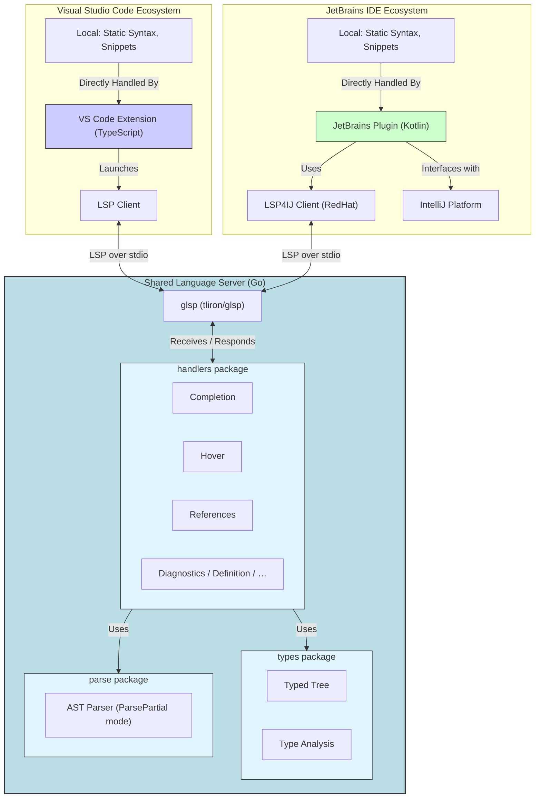

# Language Server Architecture

The server is implemented in Go using [glsp](https://github.com/tliron/glsp). It communicates with IDE clients via stdio.

## System Overview



## Architecture

### Core Components

#### `main.go`

- Entry point for the server
- Sets up logging (using `zerolog`)
- Initializes handlers and starts the server

#### `handlers/` Package

- **initialize.go** - Handles LSP initialization, capabilities registration
- **documents.go** - Manages document lifecycle (open, change, close)
- **completion.go** - Provides code completion suggestions
- **references.go** - Finds all references to a symbol
- **configuration.go** - Manages server configuration
- **initialize_test.go, documents_test.go, etc.** - Unit tests

#### Key Design Pattern

Each handler follows this pattern:

```go
func handlerName(ctx *glsp.Context, params *protocol.SomeParams) (any, error) {
    // Handle the request
    // Return result and error
}
```

## How the Server Works

### 1. Initialization

When a client connects:

1. Client sends `initialize` request with capabilities
2. Server registers its capabilities (what it can do)
3. Sends back supported features
4. Client sends `initialized` notification

```go
// Initialize sets server capabilities
func initialize(ctx *glsp.Context, params *protocol.InitializeParams) (any, error) {
    return protocol.InitializeResult{
        Capabilities: protocol.ServerCapabilities{
            CompletionProvider: &protocol.CompletionOptions{...},
            ReferencesProvider: true,
            // ... other capabilities
        },
    }, nil
}
```

### 2. Document Management

The server tracks open documents using the `documents` handler:

- **didOpen** - Document opened in editor
- **didChange** - Document content changed
- **didClose** - Document closed

```go
func DidOpen(ctx *glsp.Context, params *protocol.DidOpenTextDocumentParams) error {
    // Parse and analyze the document
    // Store in internal cache
    return nil
}
```

### 3. Feature Handlers

#### Completion

Returns a list of completion items when the user requests code completion. It relies on the parser to build the context (scope, path to the node). Completions also work with context aware pipes, we only suggest some function if the output of the previous function is a valid input of a new function.
The completions can either be triggered by typing or by pressing <kbd>Ctrl</kbd>+<kbd>Space</kbd>. A ```FilterText``` is used in the response to allow JetBrains to autocomplete variable names correctly.

```go
func completion(ctx *glsp.Context, params *protocol.CompletionParams) (any, error) {
    // 1. Get document content
    // 2. Parse template to understand context
    // 3. Determine what to suggest based on cursor position and context
    // 4. Return []protocol.CompletionItem
}
```

#### References

Finds all usages of a symbol in the workspace.

```go
func References(ctx *glsp.Context, params *protocol.ReferenceParams) (any, error) {
    // 1. Identify the symbol at cursor position
    // 2. Search all open documents for references
    // 3. Return []protocol.Location
}
```

#### Configuration

Receives configuration changes from the client.

```go
func ConfigChanged(ctx *glsp.Context, params *protocol.DidChangeConfigurationParams) error {
    // Parse new configuration
    // Apply changes to server behavior
    return nil
}
```

## Adding a New Handler

To add a new LSP feature (e.g., hover information):

### 1. Create Handler Function

In `handlers/hover.go`:

```go
package handlers

import (
    "github.com/tliron/glsp"
    protocol "github.com/tliron/glsp/protocol_3_16"
)

func Hover(ctx *glsp.Context, params *protocol.HoverParams) (any, error) {
    // 1. Extract document URI and position
    uri := params.TextDocument.URI
    position := params.Position
    
    // 2. Get document content
    doc := getDocument(uri)
    if doc == nil {
        return nil, nil // No info available
    }
    
    // 3. Parse and analyze at position
    symbol := analyzeAtPosition(doc, position)
    if symbol == nil {
        return nil, nil
    }
    
    // 4. Build hover info
    return protocol.Hover{
        Contents: protocol.MarkupContent{
            Kind:  "markdown",
            Value: formatMarkdown(symbol),
        },
    }, nil
}

func formatMarkdown(symbol *Symbol) string {
    return fmt.Sprintf("**%s** - %s", symbol.Name, symbol.Type)
}
```

### 2. Register Handler

In `initialize.go`, add to `setupHandlers()`:

```go
func setupHandlers() {
    handler = protocol.Handler{
        Initialize:                      initialize,
        Initialized:                     initialized,
        Shutdown:                        shutdown,
        TextDocumentCompletion:          handlers.CompletionWithFallback,
        TextDocumentDidOpen:             handlers.DidOpen,
        TextDocumentDidChange:           handlers.DidChange,
        TextDocumentDidClose:            handlers.DidClose,
        TextDocumentHover:               handlers.Hover,  // <-- add here
        TextDocumentReferences:          handlers.References, 
        // ... other handlers
    }
}
```

### 3. Add Capability Declaration

In `initialize()` function, add to `ServerCapabilities`:

```go
func initialize(_ *glsp.Context, _ *protocol.InitializeParams) (any, error) {
    return protocol.InitializeResult{
        Capabilities: protocol.ServerCapabilities{
            // ... existing capabilities
            HoverProvider: true,  // <-- Add here
        },
    }, nil
}
```

### 4. Write Tests

In `handlers/hover_test.go`. The test suite uses a shared `store` (the `documentStore`) and small helpers to configure the server for the duration of a test:

```go
package handlers

import (
    "testing"

    "github.com/stretchr/testify/require"
    protocol "github.com/tliron/glsp/protocol_3_16"
)

// TestMain (in main_test.go) seeds global functions before any test runs:
//
//   func TestMain(m *testing.M) {
//       types.SetGlobalFuncs(types.BuiltinFuncs())
//       os.Exit(m.Run())
//   }

func TestHover(t *testing.T) {
    enableHover(t) // sets EnableHover: true and restores original config after the test

    uri := "file:///test/document.go"
    store.Set(uri, "{{ .Name }}")
    t.Cleanup(func() { store.Remove(uri) })

    params := &protocol.HoverParams{
        TextDocumentPositionParams: protocol.TextDocumentPositionParams{
            TextDocument: protocol.TextDocumentIdentifier{URI: uri},
            Position:     protocol.Position{Line: 0, Character: 4},
        },
    }

    result, err := Hover(nil, params)

    require.NoError(t, err)
    require.NotNil(t, result)
}
```

### 5. Update Client Implementations

After server support is added:

- **VS Code** - May auto-detect through LSP capabilities
- **JetBrains** - Add corresponding feature in plugin

## Server Configuration

The server accepts configuration from clients. Configuration is typically sent during initialization or via `workspace/didChangeConfiguration`.

Example configuration:

```json
{
  "goTmplSupport": {
    "enableServer": true,
    "trace": {
      "server": "verbose"
    }
  }
}
```

To use configuration in handlers:

```go
func someHandler(ctx *glsp.Context, params *protocol.SomeParams) (any, error) {
    config := getConfig()
    if !config.EnableServer {
        return nil, nil
    }
    // ... process request
}
```

## Logging

The server uses `zerolog` for structured logging. Log output goes to stderr (stdout is reserved for LSP protocol messages).

```go
import "github.com/rs/zerolog/log"

func someHandler(ctx *glsp.Context, params *protocol.SomeParams) (any, error) {
    log.Debug().Str("uri", params.TextDocument.URI).Msg("processing request")
    log.Info().Any("result", result).Msg("request completed")
    log.Error().Err(err).Msg("handler failed")
}
```

## Dependencies

- **glsp** - LSP protocol implementation
- **zerolog** - Structured logging
- **Go text/template parser** - Standard library template parsing

See `server/go.mod` for version information.

## Testing the Server

### Unit Tests

```bash
cd server
go test ./handlers -v
```

### Integration Testing

The VS Code extension and JetBrains plugin both include integration tests that exercise the server end-to-end. See [vscode-testing.md](vscode/vscode-testing.md) and [jetbrains-testing.md](jetbrains/jetbrains-testing.md).

### Extending the language
It is possible to supplement own version of the parser, which handles additional syntax, beyond base text/template. This is handled by `//go:build` tags. If the extended language implements any new NodeTypes in the AST, a new copy of the `ext_dispatch.go` is needed. This file serves as the interface between main operation, and the extension which handles operation on these new node types.

## Resources

- [LSP Specification](https://microsoft.github.io/language-server-protocol/specifications/lsp/3.16/specification/)
- [glsp GitHub](https://github.com/tliron/glsp)
- [Go text/template docs](https://pkg.go.dev/text/template)
